<div align="center">


<a href="https://github.com/XFairesV1">
  
</a>

<br />



<br /><br />



<br /><br />


</div>

<hr />


```typescript
const xfaires = {
  role: "Full Stack Developer",
  frontend: ["TypeScript", "React", "Vite", "Tailwind"],
  backend: ["Python", "FastAPI", "Node.js", "NestJS", "Prisma"],
  database: ["PostgreSQL", "Redis"],
  others: ["Rust", "Go", "C", "Docker", "Linux"],
  building: ["SaaS", "CRMs", "dashboards financeiros", "landing pages"],
};
```

- Desenvolvo sistemas completos, do banco de dados ao deploy.
- Integro gateways de pagamento, WhatsApp e APIs de terceiros.
- Nas horas vagas, escrevo apps desktop em **Rust**.

<div align="center">


</div>
